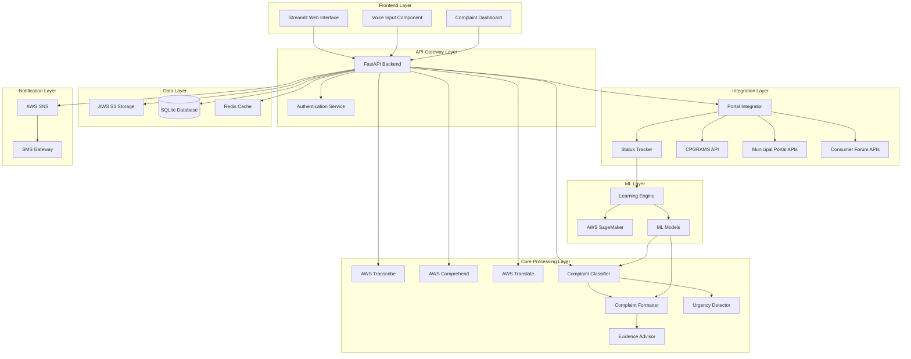

# Design Document: Nyaya Sahayak (Justice Helper)

## Overview

Nyaya Sahayak is a voice-first, AI-powered grievance assistant system built on AWS infrastructure with a Streamlit frontend. The system enables low-literacy, multilingual citizens to file structured complaints across Indian government portals through natural voice interaction. The architecture prioritizes accessibility, low-bandwidth operation, and continuous learning from successful complaint patterns.

The system consists of six major subsystems: Voice Processing Pipeline, AI Classification Engine, Complaint Generation System, Portal Integration Layer, Notification Service, and Learning Engine. These components work together to transform spoken grievances into professionally formatted complaints, file them with appropriate authorities, and track resolution progress.

## Architecture

### High-Level System Architecture



### Deployment Architecture

The system uses a serverless-first approach for scalability and cost-effectiveness:

- **Frontend**: Streamlit application deployed on AWS EC2 or ECS
- **API Layer**: FastAPI backend on AWS Lambda with API Gateway
- **Storage**: AWS S3 for audio/documents, SQLite (prototype) or RDS (production) for structured data
- **Caching**: Redis for session management and frequently accessed data
- **ML Processing**: AWS SageMaker for model training and inference
- **Notifications**: AWS SNS for SMS delivery

### Data Flow

1. **Voice Input Flow**: Citizen speaks → Audio captured → Uploaded to S3 → AWS Transcribe processes → Text returned → Displayed for verification
2. **Classification Flow**: Verified text → AWS Comprehend extracts entities → Custom classifier determines category → Confidence score evaluated → Clarification if needed
3. **Formatting Flow**: Classified complaint → Template selected → AWS Translate for bilingual output → Formatted document generated → Citizen review
4. **Filing Flow**: Approved complaint → Portal Integrator authenticates → Submits to target portal → Captures reference number → Stores in database
5. **Tracking Flow**: Scheduled job → Queries portal APIs → Compares status → Updates database → Triggers SMS if changed
6. **Learning Flow**: Resolved complaints → Feature extraction → Model retraining → Template updates → Deployment

## Components and Interfaces

### 1. Voice Processing Pipeline

**Purpose**: Capture, process, and transcribe voice input in multiple Indian languages.

**Components**:
- **Audio Capture Module**: Browser-based audio recording using Web Audio API
- **Audio Preprocessor**: Noise reduction and audio quality enhancement
- **Transcription Service**: AWS Transcribe integration with language detection
- **Text Verification Interface**: Display transcribed text with edit capabilities

**Interfaces**:

```python
class VoiceProcessor:
    def start_recording() -> RecordingSession:
        """Initiates audio recording session"""
        
    def stop_recording(session: RecordingSession) -> AudioFile:
        """Stops recording and returns audio file"""
        
    def upload_audio(audio: AudioFile) -> str:
        """Uploads audio to S3, returns S3 URI"""
        
    def transcribe_audio(s3_uri: str, language: str) -> TranscriptionResult:
        """Transcribes audio using AWS Transcribe"""
        
    def detect_language(audio: AudioFile) -> str:
        """Detects spoken language from audio"""
        
class TranscriptionResult:
    text: str
    confidence: float
    language: str
    timestamps: List[Tuple[float, float, str]]
    alternatives: List[str]
```

**Key Design Decisions**:
- Use AWS Transcribe for robust multilingual support (supports Hindi, Tamil, Telugu, Marathi)
- Store audio files in S3 with lifecycle policies (delete after 90 days)
- Implement client-side audio compression to reduce bandwidth
- Provide real-time visual feedback during recording
- Support both streaming and batch transcription modes

### 2. AI Classification Engine

**Purpose**: Automatically categorize complaints and extract key entities.

**Components**:
- **Entity Extractor**: Uses AWS Comprehend to identify locations, dates, organizations, persons
- **Category Classifier**: Custom ML model trained on Indian complaint data
- **Confidence Evaluator**: Determines if clarification is needed
- **Clarification Dialog Manager**: Generates and manages follow-up questions

**Interfaces**:

```python
class ComplaintClassifier:
    def extract_entities(text: str, language: str) -> List[Entity]:
        """Extracts named entities from complaint text"""
        
    def classify_complaint(text: str, entities: List[Entity]) -> ClassificationResult:
        """Classifies complaint into categories"""
        
    def get_target_authority(category: str, location: str) -> Authority:
        """Determines appropriate filing authority"""
        
    def generate_clarification_questions(result: ClassificationResult) -> List[str]:
        """Generates questions when confidence is low"""
        
class ClassificationResult:
    primary_category: str  # Municipal, Consumer, Police, RTI, Other
    subcategory: str
    confidence: float
    target_portal: str
    authority: Authority
    reasoning: str
    
class Entity:
    text: str
    type: str  # LOCATION, DATE, ORGANIZATION, PERSON, etc.
    confidence: float
    start_offset: int
    end_offset: int
```

**Key Design Decisions**:
- Use AWS Comprehend for entity extraction (supports custom entity recognition)
- Train custom SageMaker model for Indian complaint categorization
- Implement confidence threshold of 0.7 for automatic classification
- Use decision tree for multi-factor classification (keywords + entities + context)
- Maintain category-to-portal mapping in configuration database

**Classification Logic**:
1. Extract entities (location, organization, person, date)
2. Identify keywords (water, electricity, fraud, theft, information, etc.)
3. Analyze context and relationships between entities
4. Apply rule-based filters for edge cases
5. Use ML model for final classification
6. Calculate confidence score
7. Generate clarification questions if confidence < 0.7

### 3. Complaint Formatter

**Purpose**: Generate professionally formatted, legally structured complaint documents.

**Components**:
- **Template Manager**: Maintains complaint templates for each category
- **Content Generator**: Fills templates with extracted information
- **Legal Language Processor**: Converts informal language to formal legal language
- **Bilingual Generator**: Creates parallel English and local language versions
- **PDF Generator**: Creates downloadable PDF documents

**Interfaces**:

```python
class ComplaintFormatter:
    def load_template(category: str, subcategory: str) -> Template:
        """Loads appropriate complaint template"""
        
    def format_complaint(
        template: Template,
        grievance_text: str,
        entities: List[Entity],
        citizen_info: CitizenInfo
    ) -> FormattedComplaint:
        """Generates formatted complaint document"""
        
    def translate_complaint(complaint: FormattedComplaint, target_lang: str) -> str:
        """Translates complaint to target language"""
        
    def generate_pdf(complaint: FormattedComplaint) -> bytes:
        """Generates PDF version of complaint"""
        
class FormattedComplaint:
    reference_id: str
    subject: str
    complainant_details: CitizenInfo
    complaint_body: str
    requested_action: str
    evidence_list: List[str]
    declaration: str
    date: datetime
    language: str
    translated_version: Optional[str]
```

**Template Structure**:

Each complaint template follows this structure:
```
To: [Authority Name and Address]
From: [Complainant Details]
Date: [Filing Date]
Subject: [Auto-generated subject line]

Respected Sir/Madam,

[Opening paragraph with context]

[Detailed description of grievance with facts]

[Impact statement]

[Requested action/relief]

[Evidence reference]

[Closing with declaration]

Sincerely,
[Complainant Name]
[Contact Information]
```

**Key Design Decisions**:
- Maintain separate templates for each complaint category
- Use AWS Translate for bilingual generation
- Preserve legal accuracy during translation
- Include standard legal phrases and declarations
- Auto-generate subject lines from complaint content
- Format dates and addresses according to Indian standards

### 4. Evidence Advisor

**Purpose**: Guide citizens on required supporting documentation.

**Components**:
- **Evidence Rule Engine**: Maps complaint types to required evidence
- **Upload Manager**: Handles file uploads with validation
- **Image Guidance System**: Provides photography tips
- **Completeness Checker**: Validates evidence before submission

**Interfaces**:

```python
class EvidenceAdvisor:
    def get_required_evidence(category: str, subcategory: str) -> List[EvidenceRequirement]:
        """Returns list of required and optional evidence"""
        
    def validate_upload(file: UploadedFile) -> ValidationResult:
        """Validates file format, size, and quality"""
        
    def generate_photo_guidance(evidence_type: str) -> PhotoGuidance:
        """Provides tips for capturing evidence photos"""
        
    def check_completeness(
        category: str,
        uploaded_evidence: List[Evidence]
    ) -> CompletenessReport:
        """Checks if all required evidence is provided"""
        
class EvidenceRequirement:
    type: str  # photo, document, witness_info, bill, receipt
    required: bool
    description: str
    examples: List[str]
    format_requirements: str
    
class Evidence:
    id: str
    type: str
    filename: str
    s3_uri: str
    upload_date: datetime
    file_size: int
    metadata: dict
```

**Evidence Rules by Category**:

- **Municipal Complaints**: Photos of issue, location proof, previous complaint copies (if any)
- **Consumer Complaints**: Purchase bill/receipt, product photos, warranty card, communication records
- **Police Complaints**: FIR copy (if filed), witness details, evidence photos, medical reports (if applicable)
- **RTI Requests**: Identity proof, address proof, previous correspondence (if any)

**Key Design Decisions**:
- Store evidence files in S3 with complaint reference as prefix
- Validate file types (JPEG, PNG, PDF) and size limits (5MB per file)
- Provide visual guides for photo evidence
- Allow multiple files per evidence type
- Compress images before upload to save bandwidth

### 5. Portal Integration Layer

**Purpose**: Interface with government complaint portals for filing and tracking.

**Components**:
- **Portal Adapter Factory**: Creates appropriate adapter for each portal
- **Authentication Manager**: Handles portal login and session management
- **Submission Handler**: Formats and submits complaints to portals
- **Status Scraper**: Retrieves complaint status from portals
- **Retry Manager**: Handles failed submissions with exponential backoff

**Interfaces**:

```python
class PortalIntegrator:
    def get_adapter(portal_name: str) -> PortalAdapter:
        """Returns appropriate portal adapter"""
        
    def authenticate(portal: str, credentials: dict) -> Session:
        """Authenticates with portal"""
        
    def submit_complaint(
        portal: str,
        complaint: FormattedComplaint,
        evidence: List[Evidence],
        session: Session
    ) -> SubmissionResult:
        """Submits complaint to portal"""
        
    def check_status(portal: str, reference_id: str, session: Session) -> ComplaintStatus:
        """Retrieves current complaint status"""
        
class PortalAdapter:
    """Abstract base class for portal-specific adapters"""
    def login(credentials: dict) -> Session:
        """Portal-specific login"""
        
    def submit(complaint: FormattedComplaint, evidence: List[Evidence]) -> str:
        """Portal-specific submission, returns reference ID"""
        
    def get_status(reference_id: str) -> ComplaintStatus:
        """Portal-specific status retrieval"""
        
class SubmissionResult:
    success: bool
    reference_id: Optional[str]
    portal_url: Optional[str]
    error_message: Optional[str]
    submission_timestamp: datetime
    
class ComplaintStatus:
    reference_id: str
    status: str  # submitted, under_review, resolved, rejected, escalated
    last_updated: datetime
    remarks: Optional[str]
    assigned_officer: Optional[str]
    expected_resolution_date: Optional[datetime]
```

**Portal-Specific Adapters**:

1. **CPGRAMS Adapter**: Uses CPGRAMS API for central government complaints
2. **Municipal Portal Adapter**: Interfaces with city-specific municipal portals
3. **Consumer Forum Adapter**: Submits to National Consumer Helpline or state forums
4. **Police Portal Adapter**: Interfaces with state police complaint systems
5. **Mock Adapter**: For prototype testing without actual portal integration

**Key Design Decisions**:
- Use adapter pattern for portal-specific implementations
- Implement retry logic with exponential backoff (3 attempts)
- Cache portal sessions to reduce authentication overhead
- Store portal credentials securely using AWS Secrets Manager
- Generate local reference IDs even if portal submission fails
- Queue failed submissions for manual review

### 6. Tracking System

**Purpose**: Monitor complaint status across multiple portals.

**Components**:
- **Status Poller**: Scheduled job to check complaint status
- **Change Detector**: Identifies status changes
- **History Manager**: Maintains status change history
- **Alert Generator**: Triggers notifications on status changes

**Interfaces**:

```python
class TrackingSystem:
    def register_complaint(
        complaint_id: str,
        portal: str,
        portal_reference: str
    ) -> None:
        """Registers complaint for tracking"""
        
    def poll_status(complaint_id: str) -> ComplaintStatus:
        """Checks current status from portal"""
        
    def get_status_history(complaint_id: str) -> List[StatusChange]:
        """Returns complete status history"""
        
    def detect_overdue_complaints() -> List[str]:
        """Identifies complaints exceeding expected resolution time"""
        
class StatusChange:
    complaint_id: str
    old_status: str
    new_status: str
    timestamp: datetime
    remarks: Optional[str]
    triggered_notification: bool
```

**Polling Strategy**:
- Poll every 6 hours for complaints in "submitted" or "under_review" status
- Poll daily for complaints in "escalated" status
- Stop polling for "resolved" or "rejected" complaints
- Implement rate limiting to avoid portal blocking
- Use exponential backoff if portal is unresponsive

**Key Design Decisions**:
- Use AWS Lambda with CloudWatch Events for scheduled polling
- Store status history for audit trail
- Implement intelligent polling frequency based on status
- Cache recent status checks to reduce API calls
- Generate alerts only for meaningful status changes

### 7. Notification Service

**Purpose**: Send SMS notifications to citizens about complaint updates.

**Components**:
- **SMS Gateway**: AWS SNS integration for SMS delivery
- **Message Composer**: Generates localized SMS messages
- **Delivery Tracker**: Monitors SMS delivery status
- **Retry Handler**: Retries failed SMS deliveries

**Interfaces**:

```python
class NotificationService:
    def send_sms(
        phone_number: str,
        message: str,
        language: str
    ) -> DeliveryResult:
        """Sends SMS notification"""
        
    def compose_message(
        template: str,
        params: dict,
        language: str
    ) -> str:
        """Generates localized SMS message"""
        
    def get_delivery_status(message_id: str) -> DeliveryStatus:
        """Checks SMS delivery status"""
        
class DeliveryResult:
    message_id: str
    success: bool
    delivery_status: str
    error_message: Optional[str]
    timestamp: datetime
```

**SMS Message Templates**:

```
# Complaint Filed (English)
"Your complaint #{ref_id} has been filed with {authority}. Track status at {url}"

# Complaint Filed (Hindi)
"आपकी शिकायत #{ref_id} {authority} के पास दर्ज की गई है। स्थिति देखें: {url}"

# Status Update (English)
"Complaint #{ref_id} status: {status}. {remarks}"

# Status Update (Hindi)
"शिकायत #{ref_id} स्थिति: {status}। {remarks}"
```

**Key Design Decisions**:
- Use AWS SNS for reliable SMS delivery
- Keep messages under 160 characters when possible
- Include complaint reference ID in all messages
- Provide short URLs for tracking links
- Retry failed deliveries up to 3 times over 24 hours
- Log all SMS attempts for audit purposes

### 8. Urgency Detection System

**Purpose**: Identify time-sensitive and critical complaints.

**Components**:
- **Keyword Analyzer**: Detects urgency-indicating keywords
- **Severity Classifier**: ML model to classify urgency level
- **Escalation Recommender**: Suggests escalation pathways
- **Priority Queue Manager**: Manages urgent complaint processing

**Interfaces**:

```python
class UrgencyDetector:
    def analyze_urgency(
        complaint_text: str,
        category: str,
        entities: List[Entity]
    ) -> UrgencyAssessment:
        """Analyzes complaint urgency"""
        
    def get_escalation_pathway(
        category: str,
        urgency: str,
        location: str
    ) -> EscalationPath:
        """Returns recommended escalation steps"""
        
class UrgencyAssessment:
    level: str  # critical, high, medium, low
    confidence: float
    reasoning: str
    keywords_found: List[str]
    recommended_actions: List[str]
    
class EscalationPath:
    steps: List[EscalationStep]
    estimated_timeline: str
    success_rate: float
    
class EscalationStep:
    authority: str
    contact_info: str
    expected_response_time: str
    required_documents: List[str]
```

**Urgency Keywords by Category**:

- **Critical**: emergency, danger, life-threatening, immediate, urgent, fire, flood, collapse, accident
- **High**: safety, health hazard, contamination, violence, theft, fraud, deadline
- **Medium**: delay, pending, overdue, repeated, ignored
- **Low**: general inquiry, suggestion, feedback

**Key Design Decisions**:
- Use rule-based system combined with ML classifier
- Consider complaint category in urgency assessment
- Flag safety-related keywords automatically as high priority
- Suggest emergency services contact for critical issues
- Track urgency assessment accuracy for model improvement

### 9. Learning Engine

**Purpose**: Continuously improve complaint templates and classification based on successful outcomes.

**Components**:
- **Outcome Tracker**: Monitors complaint resolution outcomes
- **Pattern Analyzer**: Identifies patterns in successful complaints
- **Template Optimizer**: Updates templates based on successful patterns
- **Model Retrainer**: Periodically retrains classification models

**Interfaces**:

```python
class LearningEngine:
    def record_outcome(
        complaint_id: str,
        outcome: str,
        resolution_time: int,
        citizen_satisfaction: int
    ) -> None:
        """Records complaint outcome for learning"""
        
    def analyze_successful_patterns(category: str) -> PatternAnalysis:
        """Analyzes patterns in successful complaints"""
        
    def update_template(
        category: str,
        improvements: List[TemplateImprovement]
    ) -> None:
        """Updates complaint template"""
        
    def retrain_classifier(training_data: List[TrainingExample]) -> ModelMetrics:
        """Retrains classification model"""
        
class PatternAnalysis:
    category: str
    successful_count: int
    common_phrases: List[str]
    effective_evidence_types: List[str]
    average_resolution_time: float
    success_rate: float
    
class TemplateImprovement:
    section: str
    current_text: str
    suggested_text: str
    confidence: float
    based_on_complaints: int
```

**Learning Pipeline**:

1. **Data Collection**: Gather resolved complaints with outcomes
2. **Feature Extraction**: Extract linguistic features, structure, evidence types
3. **Pattern Mining**: Identify common elements in successful complaints
4. **A/B Testing**: Test template variations with small user groups
5. **Performance Monitoring**: Track resolution rates for each template version
6. **Deployment**: Roll out improved templates if performance improves
7. **Rollback**: Revert if performance degrades

**Key Design Decisions**:
- Use AWS SageMaker for model training and deployment
- Implement A/B testing framework for template changes
- Require minimum 100 complaints before template updates
- Monitor resolution rate as primary success metric
- Retrain classification model monthly with new data
- Maintain version history of all templates

### 10. User Interface (Streamlit)

**Purpose**: Provide accessible, intuitive interface for citizens and NGO workers.

**Components**:
- **Voice Input Screen**: Audio recording interface
- **Complaint Form**: Guided complaint creation workflow
- **Dashboard**: View and manage filed complaints
- **Status Tracker**: Real-time complaint status display
- **Settings**: Language preferences, profile management

**Key Screens**:

1. **Home Screen**:
   - Large "File New Complaint" button with microphone icon
   - Recent complaints list
   - Quick status check
   - Language selector

2. **Voice Input Screen**:
   - Visual recording indicator
   - Waveform display
   - Stop/Pause/Resume controls
   - Transcription display with edit option

3. **Complaint Review Screen**:
   - Classified category display
   - Formatted complaint preview
   - Evidence upload section
   - Submit button

4. **Dashboard Screen**:
   - Complaint cards with status badges
   - Filter by status/category
   - Search by reference ID
   - Bulk actions for NGO users

5. **Detail Screen**:
   - Full complaint text
   - Status timeline
   - Evidence gallery
   - Download PDF button
   - Escalation options

**Key Design Decisions**:
- Use large, touch-friendly buttons for mobile users
- Implement progressive disclosure to avoid overwhelming users
- Provide voice guidance for all major actions
- Use color-coded status indicators (green=resolved, yellow=pending, red=urgent)
- Support both light and dark themes
- Optimize for slow connections with lazy loading

## Data Models

### Core Entities

```python
class Citizen:
    id: str  # UUID
    phone_number: str  # Primary identifier
    name: str
    preferred_language: str
    address: Optional[str]
    email: Optional[str]
    created_at: datetime
    last_login: datetime
    account_type: str  # individual, ngo_worker
    linked_citizens: List[str]  # For NGO accounts
    
class Complaint:
    id: str  # UUID
    citizen_id: str
    reference_number: str  # User-facing reference
    category: str
    subcategory: str
    original_text: str  # Transcribed grievance
    formatted_text: str  # Professional complaint
    language: str
    status: str
    urgency_level: str
    created_at: datetime
    updated_at: datetime
    portal: str
    portal_reference: str
    expected_resolution_date: Optional[datetime]
    actual_resolution_date: Optional[datetime]
    citizen_satisfaction: Optional[int]
    
class Evidence:
    id: str
    complaint_id: str
    type: str
    filename: str
    s3_uri: str
    file_size: int
    mime_type: str
    uploaded_at: datetime
    metadata: dict
    
class StatusHistory:
    id: str
    complaint_id: str
    old_status: str
    new_status: str
    changed_at: datetime
    remarks: Optional[str]
    changed_by: str  # system or portal
    
class Notification:
    id: str
    citizen_id: str
    complaint_id: str
    type: str  # sms, email, in_app
    message: str
    sent_at: datetime
    delivery_status: str
    delivery_attempts: int
    
class Template:
    id: str
    category: str
    subcategory: str
    language: str
    version: int
    content: str
    active: bool
    created_at: datetime
    success_rate: float
    usage_count: int
    
class Portal:
    id: str
    name: str
    type: str  # cpgrams, municipal, consumer, police
    base_url: str
    api_endpoint: Optional[str]
    requires_auth: bool
    supported_categories: List[str]
    active: bool
    rate_limit: int  # requests per hour
```

### Database Schema (SQLite for Prototype)

```sql
CREATE TABLE citizens (
    id TEXT PRIMARY KEY,
    phone_number TEXT UNIQUE NOT NULL,
    name TEXT NOT NULL,
    preferred_language TEXT DEFAULT 'en',
    address TEXT,
    email TEXT,
    created_at TIMESTAMP DEFAULT CURRENT_TIMESTAMP,
    last_login TIMESTAMP,
    account_type TEXT DEFAULT 'individual'
);

CREATE TABLE complaints (
    id TEXT PRIMARY KEY,
    citizen_id TEXT NOT NULL,
    reference_number TEXT UNIQUE NOT NULL,
    category TEXT NOT NULL,
    subcategory TEXT,
    original_text TEXT NOT NULL,
    formatted_text TEXT NOT NULL,
    language TEXT NOT NULL,
    status TEXT DEFAULT 'draft',
    urgency_level TEXT DEFAULT 'medium',
    created_at TIMESTAMP DEFAULT CURRENT_TIMESTAMP,
    updated_at TIMESTAMP DEFAULT CURRENT_TIMESTAMP,
    portal TEXT,
    portal_reference TEXT,
    expected_resolution_date TIMESTAMP,
    actual_resolution_date TIMESTAMP,
    citizen_satisfaction INTEGER,
    FOREIGN KEY (citizen_id) REFERENCES citizens(id)
);

CREATE TABLE evidence (
    id TEXT PRIMARY KEY,
    complaint_id TEXT NOT NULL,
    type TEXT NOT NULL,
    filename TEXT NOT NULL,
    s3_uri TEXT NOT NULL,
    file_size INTEGER,
    mime_type TEXT,
    uploaded_at TIMESTAMP DEFAULT CURRENT_TIMESTAMP,
    metadata TEXT,  -- JSON
    FOREIGN KEY (complaint_id) REFERENCES complaints(id)
);

CREATE TABLE status_history (
    id TEXT PRIMARY KEY,
    complaint_id TEXT NOT NULL,
    old_status TEXT,
    new_status TEXT NOT NULL,
    changed_at TIMESTAMP DEFAULT CURRENT_TIMESTAMP,
    remarks TEXT,
    changed_by TEXT,
    FOREIGN KEY (complaint_id) REFERENCES complaints(id)
);

CREATE TABLE notifications (
    id TEXT PRIMARY KEY,
    citizen_id TEXT NOT NULL,
    complaint_id TEXT,
    type TEXT NOT NULL,
    message TEXT NOT NULL,
    sent_at TIMESTAMP DEFAULT CURRENT_TIMESTAMP,
    delivery_status TEXT DEFAULT 'pending',
    delivery_attempts INTEGER DEFAULT 0,
    FOREIGN KEY (citizen_id) REFERENCES citizens(id),
    FOREIGN KEY (complaint_id) REFERENCES complaints(id)
);

CREATE TABLE templates (
    id TEXT PRIMARY KEY,
    category TEXT NOT NULL,
    subcategory TEXT,
    language TEXT NOT NULL,
    version INTEGER DEFAULT 1,
    content TEXT NOT NULL,
    active BOOLEAN DEFAULT 1,
    created_at TIMESTAMP DEFAULT CURRENT_TIMESTAMP,
    success_rate REAL DEFAULT 0.0,
    usage_count INTEGER DEFAULT 0
);

CREATE TABLE portals (
    id TEXT PRIMARY KEY,
    name TEXT NOT NULL,
    type TEXT NOT NULL,
    base_url TEXT NOT NULL,
    api_endpoint TEXT,
    requires_auth BOOLEAN DEFAULT 0,
    supported_categories TEXT,  -- JSON array
    active BOOLEAN DEFAULT 1,
    rate_limit INTEGER DEFAULT 100
);

CREATE INDEX idx_complaints_citizen ON complaints(citizen_id);
CREATE INDEX idx_complaints_status ON complaints(status);
CREATE INDEX idx_complaints_reference ON complaints(reference_number);
CREATE INDEX idx_evidence_complaint ON evidence(complaint_id);
CREATE INDEX idx_status_history_complaint ON status_history(complaint_id);
CREATE INDEX idx_notifications_citizen ON notifications(citizen_id);
```

### S3 Storage Structure

```
nyaya-sahayak-bucket/
├── audio/
│   ├── {citizen_id}/
│   │   └── {complaint_id}/
│   │       └── {timestamp}.wav
├── evidence/
│   ├── {complaint_id}/
│   │   ├── photo_1.jpg
│   │   ├── photo_2.jpg
│   │   └── document.pdf
├── generated-pdfs/
│   └── {complaint_id}/
│       └── complaint_{reference_number}.pdf
└── ml-models/
    ├── classifier/
    │   └── model_v{version}.tar.gz
    └── urgency-detector/
        └── model_v{version}.tar.gz
```

## Correctness Properties

*A property is a characteristic or behavior that should hold true across all valid executions of a system—essentially, a formal statement about what the system should do. Properties serve as the bridge between human-readable specifications and machine-verifiable correctness guarantees.*

Before defining the correctness properties, let me analyze the acceptance criteria for testability:

<function_calls>
<invoke name="prework">
<parameter name="featureName">nyaya-sahayak


### Property 1: Voice Input Round Trip
*For any* audio recording session, when a citizen records audio, the system should capture it, process it through transcription, and display the transcribed text for verification.
**Validates: Requirements 1.1, 1.4, 1.5**

### Property 2: Multilingual Voice Support
*For any* audio input in Hindi, Tamil, Bengali, Telugu, Marathi, Gujarati, Kannada, Malayalam, Punjabi, or English, the Voice_Input_Module should successfully transcribe the audio to text.
**Validates: Requirements 1.2**

### Property 3: Voice Input Error Handling
*For any* poor quality audio or network failure, the system should either prompt for better audio quality or queue the audio for later processing when connectivity is restored.
**Validates: Requirements 1.7, 1.8**

### Property 4: Transcription Editability
*For any* transcribed text, the system should provide edit controls allowing the citizen to modify the text or re-record.
**Validates: Requirements 1.6**

### Property 5: Complaint Classification Completeness
*For any* transcribed complaint text, the Complaint_Classifier should analyze it and assign exactly one of the following categories: Municipal, Consumer Protection, Police, RTI, or Other.
**Validates: Requirements 2.1, 2.2**

### Property 6: Classification Confidence Threshold
*For any* complaint classification with confidence below 70%, the system should present clarifying questions to the citizen before finalizing the category.
**Validates: Requirements 2.4**

### Property 7: Portal Mapping Consistency
*For any* classified complaint, the 